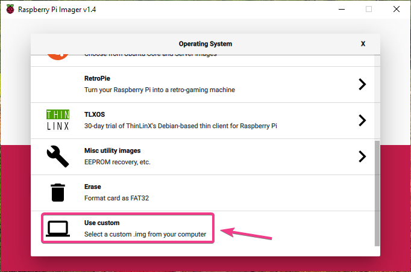
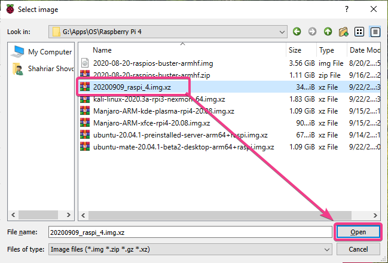
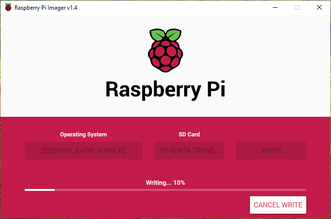

# Instalación del SO
Lo primero que hacemos es descargar la imagen del sistema operativo que deseemos  para grabar en la Raspberry.

En este caso, vamos a utilizar Debian. Nos dirigimos a la página [raspi.debian.net](raspi.debian.net) y nos descargamos la imagen en formato img.xz para Raspberry.

Por otra parte, necesitamos un instalador para grabar la imagen en una tarjeta SD.
El que vamos a usar es Raspberry Pi Imager. Simplemente lo abrimos y seleccionamos tanto la imagen descargada como la tarjeta SD de destino.

Una vez seleccionada la imagen y la tarjeta SD, pinchamos en el botón WRITE. Esperamos el proceso.

Una vez finalizado el proceso, podemos insertar la SD en la Raspberry y comenzará a cargar el sistema operativo.

Por defecto, no existen usuarios pero se puede hacer login con `root` sin contreseña. Finalmente, si se quiere añadir una contraseña al administrador, se hace de la siguiente manera:  `passwd`.
